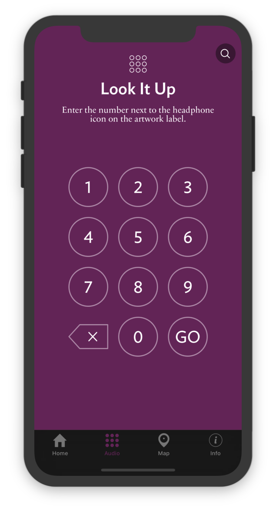
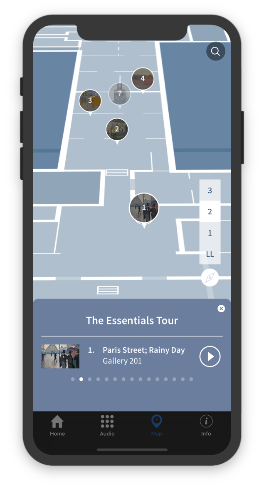
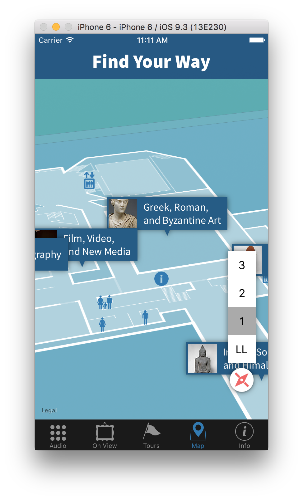
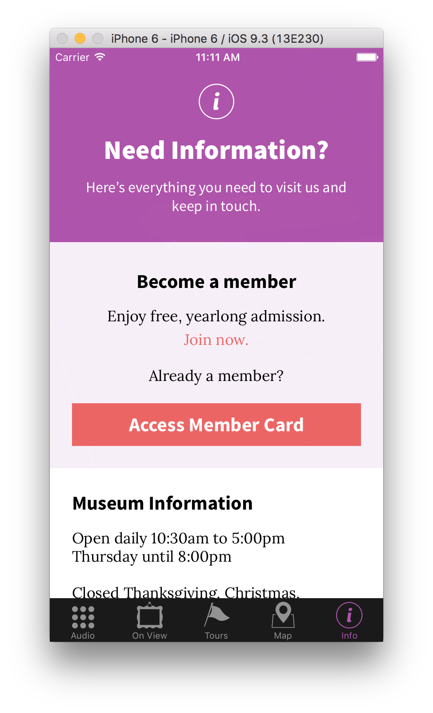

# Art Institute of Chicago Official Mobile App
> A digital guide to the Art Institute of Chicago. Built with Swift 3 for iOS.

The Art Insitute of Chicago [Official Mobile App](http://extras.artic.edu/new-mobile/) is your personal,
pocket-sized guide to our collection. The mobile experience merges location-aware technology with audio
storytelling, letting the art speak to you. The Art Institute offers nearly a million square feet to
explore—the Official Mobile App will be your guide.

The Art Institute of Chicago's mobile app launched in the iOS App Store on August 10, 2016. It's
still in place today and is being maintained by a team of internal developers.

Please note that while we took steps to generalize this project, it is not meant to be a plug-and-play product for your institution. You may need to substantially modify the iOS app, beyond basic configuration. More importantly, you may need to contact Apple regarding indoor positioning, or research and implement some open-source alternative.


## Table of Contents

1. [Features](#features)
	1. [Audio Guide](#audio-guide)
	1. [On View](#on-view)
	1. [Tours](#tours)
	1. [Map](#map)
1. [Getting Started](#getting-started)
	1. [Prerequisites](#prerequisites)
	1. [Installation](#installation)
	1. [Serving SampleData](#serving-sampledata)
1. [Configuration](#configuration)
	1. [Xcode Settings + Info.plist](#xcode-settings--infoplist)
	1. [Config.plist + Common.swift](#configplist--commonswift)
	1. [GoogleService-Info.plist](#googleservice-infoplist)
1. [Map + Indoor Positioning](#map--indoor-positioning)
    1. [Map Overlay](#map-overlay)
    1. [Aligning the Map](#aligning-the-map)
1. [Data](#data)
    1. [App Data](#app-data)
    1. [Featured Exhibitions](#featured-exhibitions)
    1. [Member Card API](#member-card-api)
1. [External Libs](#external-libs)
1. [Analytics](#analytics)
1. [Build Targets](#build-targets)
1. [Credits](#credits)


## Features

This app is split into five distinct sections. In the future, additional sections might be added as we improve our infrastructure.

<table>
  <tr>
    <td></td>
    <td valign="top">
      <h3>Audio Guide</h3>
      <p>Allows users to type in numbers found in the physical space of the museum next to artworks, which pulls up the corresponding audio content and information.</p>
    </td>
  </tr>
  <tr>
    <td></td>
    <td valign="top">
      <h3>On View</h3>
      <p>Provides a summary of current exhibits/events at the museum along with showing their location on the map.</p>
    </td>
  </tr>
  <tr>
    <td></td>
    <td valign="top">
      <h3>Tours</h3>
      <p>Provides custom tours with unique audio content that work in tandem with the map and guide users on a narrated journey. This is the section that first appears when the app starts up, and is currently the main feature.</p>
    </td>
  </tr>
  <tr>
    <td></td>
    <td valign="top">
      <h3>Map</h3>
      <p>The map is prevalent throughout the application (it is always in the background or foreground), but in this section it has a number of information points (annotations) enabled at various zoom levels. These include:</p>
      <ul>
        <li>Departments</li>
        <li>Amenities (bathrooms, elevators, etc.)</li>
        <li>Galleries</li>
        <li>Artworks</li>
      </ul>
      <p>The map uses CoreLocation to locate and orient the user when they are on-location in the museum.</p>
    </td>
  </tr>
  <tr>
    <td></td>
    <td valign="top">
      <h3>Information</h3>
      <p>This section shows basic museum info: hours, holidays, etc.</p>
    </td>
  </tr>
</table>


## Getting Started

The Official Mobile App consists of two parts: a content authoring system written in Drupal, and this repository - an iOS app written in Swift. The content authoring CMS can be found here:

https://github.com/art-institute-of-chicago/mobile-app-cms

We included some SampleData with this repo, so you don't _need_ the CMS in order to run the front-end. As long as the expected data format is followed, feel free to serve the files statically (cf. [SampleData](SampleData)) or roll your own CMS.


### Prerequisites

1. Mac OS X (tested with Sierra)
1. Xcode 8+ (Swift 3 support)
1. [Carthage](https://github.com/Carthage/Carthage)
1. [CocoaPods](https://cocoapods.org)

Currently, we need both Carthage and CocoaPods to manage this project's dependencies. We need Google Analytics for tracking user sessions and actions throughout the app, but GA was not supported by Carthage during development. We may remove CocoaPods as a prerequisite in the future.

Throughout this guide, we assume that you know the basics of using Git and Terminal, or another terminal emulator of your choice.


### Installation

Clone this repo to your computer:

```bash
git clone https://github.com/art-institute-of-chicago/aic-mobile-app.git
```

**Note:** We recommend against downloading the ZIP of this project to avoid "Missing Reference" issues. If you do download this project as a ZIP, you will need to fetch the `UIImageColors.swift` file from [jathu/UIImageColors](https://github.com/jathu/UIImageColors). Place the downloaded Swift file into the `aic/aic/ThirdParty/UIImageColors/` folder. This file will be automatically fetched if you clone the repository with Git.

Once you have downloaded the repo, one way or another, open your terminal and change your directory to the top level of the project:

```bash
cd /path/to/aic-mobile-app
```

Then, run the `install.sh` script. This script will fetch and build all of the required libraries for the app, create stub config files, and automatically launch Xcode when finished.

```bash
./install.sh
```

You should now be up-and-running in Xcode! The next steps will be to get started with some test data so you can run the app in the Simulator.


### Serving SampleData

We've provided some sample data to test the iOS frontend and to demonstrate the data format expected by the app. In order to use this sample data, you must host the `SampleData` folder on `localhost` port `8888`. You can use any webserver to do so, with some reservations. If for some reason, you cannot use port `8888`, or if you'd like to use a virtual host instead, you can edit `Config.plist` to point the app elsewhere.

**Note:** the server you choose must be able to serve correct headers for audio files. We ran into issues with `python -m SimpleHTTPServer` during testing, where the audio duration was not being reported correctly, and the app would crash. This was most likely due to a missing `Content-Length` header. For this reason, we recommend taking the time to setup a marginally more advanced localhost than `SimpleHTTPServer`.

For the purposes of this documentation, we will use [devinrhode2/pache](https://github.com/devinrhode2/pache). Pache is a script that allows you to quickly start Apache from the commandline and host a folder at a specified port. Given that Mac OS X has Apache built-in, minimal configuration is required. However, `pache` requires `node.js` and `npm`.

```bash
cd /path/to/aic-mobile-app/SampleData
pache . 8888
```

http://localhost:8888/appData.json should be pointing at [appData.json](SampleData/appData.json)

Regardless of how you chose to host the sample data, you should now be ready to run the app in the Simulator!

Go to Xcode, choose an iOS simulator (e.g. iPhone SE) for the `aic` build target, and run the build.

**References:**
* http://stackoverflow.com/questions/13695391/start-an-apache-server-in-any-directory-from-command-line
* http://stackoverflow.com/questions/24583859/apache-localhost-username-not-working
* http://stackoverflow.com/questions/24583859/apache-localhost-username-not-working


## Configuration

This section is meant to get you started with modifying the app for your own museum. There are several configs you may need to edit to suit your environment:

1. Xcode `aic` target settings (cf. `Info.plist`)
1. `Config.plist`, which overrides values initialized in `/shared/Common.swift`
1. `GoogleService-Info.plist`

For readability, we assume that all config paths are relative to the `/aic/aic` subdirectory, unless otherwise noted. For instance, when we talk about `Info.plist`, we mean `/aic/aic/Info.plist` specifically.

You might note that `Config.plist` and `GoogleService-Info.plist` are not included with the repository. Running `install.sh` as part of the [installation process](#installation) will create these files for you. Any changes you make to these files will be ignored by Git.

We'll briefly go through these files and discuss the changes you may need to make.


### Xcode Settings + Info.plist

In Xcode, open the settings for the `aic` build target ([reference](http://stackoverflow.com/a/39912255/1943591)). In the `General` pane, change the `Display Name` and `Bundle Identifier` to match your institution. You may need to bump the `Version` and `Build` numbers as your development progresses.

Next, scroll down to `App Icons and Launch Images` and swap the images with whatever as you see fit. These can also be accessed via `Assets.xcassets`.

Go to the `Info` pane, expand `URL Types (1)`, and change the `Identifier` and `URL Schemes` to match your institution. General best practice suggests that `Identifier` ought to match your `Bundle Identifier`, but it just has to be unique. Our URL-based functionality is still in development, but this is a good step to take as things progress.

See the Twitter Dev Docs for more info on [URL Schemes](https://dev.twitter.com/cards/mobile/url-schemes).

`Info.plist` is a standard file expected by most iOS apps. For the most part, it stores the information you've edited via the settings GUI. Many settings live here, but the only one of interest is `NSLocationWhenInUseageDesription`, which contains text for the dialog that a user is prompted with when we request location services access. Other settings of potential interest include fonts, status bar styles, and supported device orientations.


### Config.plist + Common.swift

`Common.swift` (located in `/aic/aic/Shared`) is the main config file for the mobile app. This is where data that is shared across `UIViews` is defined. Additionally, the `Testing` struct contains several flags that are helpful for debugging or generally understanding how data flows through the app at runtime.

Ideally, `Common.swift` should **not** be edited directly. Instead, you should edit `Config.plist` when possible. Values defined in `Config.plist` will override the values defined in `Common.swift` (see [AppDataManager.swift](aic/aic/Data/AppDataManager.swift#L34)).

For the purposes of this open-source effort, we extracted the most critical variables from `Common.swift` and put them into `Config.plist`, i.e. variables which are required for setting up the app to run using a source other than the included sample data. The intention behind this was to minimize downstream changes to `Common.swift`, so that you could more easily incorporate changes from upstream (us) in the future.

However, we realize that you may want to change some of the strings and settings in `Common.swift` directly. For the purposes of this documentation, we will focus on `Config.plist`, but we invite you to explore `Common.swift` and search through the source code (<kbd>⌘</kbd> + <kbd>Shift</kbd> + <kbd>F</kbd>) to see how these variables are being used.

Here are the variables set through `Config.plist`:

<table>
  <tr>
    <th valign="top">Variable</th>
    <th valign="top">Default</th>
    <th valign="top">Description</th>
  </tr>
  <tr>
    <td valign="top">printDataErrors</td>
    <td valign="top">true</td>
    <td valign="top">
      <p>Show data parsing errors in Xcode's console.</p>
    </td>
  </tr>
  <tr>
    <td valign="top">feedFeaturedExhibitions</td>
    <td valign="top">http://localhost:8888/exhibits.json</td>
    <td valign="top">
    <p>Your museum's event feed. See <a href="#featured-exhibitions">Featured Exhibitions</a>.</p>
    </td>
  </tr>
  <tr>
    <td valign="top">appDataJSON</td>
    <td valign="top">http://localhost:8888/appData.json</td>
    <td valign="top">
    <p>Gallery, object, audio, and tour data. See <a href="#app-data">App Data</a>.</p>
    </td>
  </tr>
  <tr>
    <td valign="top">appDataExternalPrefix</td>
    <td valign="top">http://localhost:8888/</td>
    <td valign="top" rowspan="2">
      <p>All URLs in appDataJson will have instances of internalPrefix replaced with externalPrefix (<a href="#appdataexternalprefix--appdatainternalprefix">details</a>). </p>
    </td>
  </tr>
  <tr>
    <td valign="top">appDataInternalPrefix</td>
    <td valign="top">http://localhost:8888/</td>
  </tr>
  <tr>
    <td valign="top">memberCardSOAPRequestURL</td>
    <td valign="top">http://localhost:8888/api/1?token=foobar</td>
    <td valign="top">
      <p>Your membership system's SOAP API endpoint. See <a href="#member-card-api">Member Card API</a>.</p>
    </td>
  </tr>
</table>

With this in mind, you will need to update `appDataJSON` with the full URL path of your hosted JSON file. If you are using an instance of our [Drupal-based CMS](https://github.com/art-institute-of-chicago/aic-mobile-cms), your path will likely look something like this:

```
http://example.com/sites/default/files/appData.json
```

Other settings maintained in `Common.swift` include text strings for various app sections and for the instruction slides that display when the app is launched for the first time, anchor points and bounding boxes for the PDF-based map view overlay, departmental map icon flag names, department titles, etc. For now, these sorts of hard-coded values will have to be modified in the code, but we are open to PRs that would help make it possible to define these things via the CMS.


#### appDataExternalPrefix & appDataInternalPrefix

In all URLs gathered from `appData.json`, [AppDataParser.swift](aic/aic/Data/AppDataParser.swift#L500) will replace instances of `appDataInternalPrefix` with `appDataExternalPrefix`. We needed this functionality because we draw our data from multiple APIs on the backend, and one of these APIs contains URLs that refer to a server that is accessible only behind our firewall. We needed to rewrite those URLs to point to our public server. This is a temporary measure that may be removed in the future. If you don't need this sort of functionality, feel free to set identical values for the two prefixes, and they should have no effect.


### GoogleService-Info.plist

This file stores values that are needed to associate the app with your Google Analytics account. You'll want to update the following:

```
TRACKING_ID
BUNDLE_ID
PROJECT_ID
GOOGLE_APP_ID
```

Note that this file does not exist initially, and it is not tracked by git. Like `Config.plist`, it will be created when you run `install.sh`.

See the [Analytics](#analytics) section for more info.


## Map + Indoor Positioning

The map in this application is a persistent background UI element and provides users with accurate location information throughout the Art Institutes galleries. To make indoor user-positioning as accurate as possible, the Art Institute has partnered with Apple via the [Maps Connect](https://mapsconnect.apple.com/) program. Through this program, we utilize Apple's [Indoor Survey App](http://www.theverge.com/2015/11/2/9657304/apple-indoor-mapping-survey-app) to map the wireless signals throughout our buildings, creating a fingerprint of all of the areas of our venue.

These wireless fingerprints become a part Apple's venue database and are utilized by the CoreLocation API to place the users "blue dot" on the map. By utilizing [CoreLocation](https://developer.apple.com/reference/corelocation) in combination with the on-site survey, we are able to take advantage of advanced location metrics such as current floor level to provide a better navigation experience to our app users on-site.


### Map Overlay

To present a custom map overlay on top of Apple's default map, we use custom PDFs that contain a rough outline of our galleries as derived from the CAD drawings of our museum. This is the same map that we utilize for our printed guides that are available to our on-site visitors. You can find the PDFs used for each floor level under `/aic/aic/Assets/map`. On compilation, Xcode takes these PDFs and automatically processes them for image tiling to optimize loading times at runtime.


### Aligning the Map

As a part of the Maps Connect program, we work with Apple to survey our site using higher-detailed floor plans than what we display in the app. Apple processes these plans and converts them into their custom Apple Venue Format (AVF), which is compatible with GeoJSON. As GeoJSON has latitude and longitude coordinates embedded within it, we are able to use these files to derive anchor points for our PDF overlay to ensure that "blue dot" locations displayed via CoreLocation align as closely as possible with our PDF overlay. These achor coordinates are defined in the `Common.swift` file inside of the `Map` struct with the `anchor1` and `anchor2` variables.


## Data

The application currently uses three main data sources: app data, events, and membership. The first two are JSON documents; the latter is a custom SOAP API. This data is meant to be managed through the companion CMS, but as long as the expected data format is followed, feel free to serve the files statically (cf. [SampleData](SampleData)) or roll your own CMS.


### App Data

The main app data is pulled from an external-facing server each time the application loads. This data includes galleries, objects (artworks), tours, and audio files. We've included [appData.json](SampleData/appData.json) to demonstrate how "real" data would look like.

Here's a breakdown of the expected data format:


```javascript
// Predominantly, we took the "Object of Objects" approach here. For context:
// http://stackoverflow.com/questions/31469441/array-of-objects-vs-object-of-objects

// For "galleries", "objects", and "audio_tours", each entity's "nid"
//   should match its parent property (or more accurately, vice versa)

{

  // These show up as small text on the map at higher zoom levels
  "galleries": {

    "1052": {

      "nid": 1052,

      // Galleries are referenced by title, not nid
      // Objects and exhibits that refer to invalid galleries will be hidden
      "title": "Allerton Building",

      // If true, objects from this gallery will be hidden
      "closed": false,

      // Latitude, longitude, separated with comma and optional space
      "location": "41.879565,-87.623865",

      // For the Art Institute of Chicago, floor is either a number or "LL" for lower-level
      // See AppDataParser.swift#L167
      "floor": 1

    }

  },

  "objects": {
    "1036": {

      "nid": 1036,

      "location": "41.87964734443971, -87.62376828224376",

      // Should match one of the "galleries"
      "gallery_location": "Allerton Building",

      "title": "Artwork Title",

      // Shown when the individual object is opened
      "large_image_full_path": "http://localhost:8888/placeholder.png",

      // Shown as circular thumbnail on the map
      "thumbnail_full_path": "http://localhost:8888/placeholder.png",

      // Should match one of the audio_files
      // (This particular example refers to a non-existing entry)
      "audio": [
        1028
      ]

    }
  },

  "audio_files": {

    "1027": {

      "nid": 1027,
      "title": "Introduction to Tour",
      "audio_file_url": "http://localhost:8888/unfa.mp3",
      "audio_transcript": "This is an introduction."
    }

  },

  // Note that "tours" is an Array of Objects, not Object of Objects.
  // This inconsistency is kept for historical compatibility reasons.
  "tours": [
    {
      "nid": 1023,
      "title": "Lorem Ipsum",
      "image_url": "http://example.com/link-to-banner-image.png",
      "description": "Short blurb description",
      "intro": "Transcript of tour_audio file",

      // Should match one of the "audio_files"
      "tour_audio": 1027,

      // "stops" is also an Array of Objects!
      "stops": [
        {
          // Does not have to be consecutive or integer
          "sort": 0,

          // Should match one of the "audio_files"
          "audio": 1027,

          // Should match one of the "objects"
          "object": 1036
        }
      ]
    }
  ]

}
```

For more details, see [AppDataParser.swift](aic/aic/Data/AppDataParser.swift). It's a good file to reference when you want to clarify which fields are needed. We recommend doing a project-wide search for the affected model attributes in order to find out how your data is being used.


### Featured Exhibitions

This data feed is being recycled from the Art Institute of Chicago's website. It provides a list of current exhibitions, cross-referencing gallery and floor locations from the App Data file. Here is the annotated data structure:

```javascript
[
  {

    "title": "Sample Exhibit",

    "body": "Lorem ipsum dolor sit amet, consectetur adipiscing elit. Sed est purus, mattis sed molestie ac, ultricies quis mi. Pellentesque habitant morbi tristique senectus et netus et malesuada fames ac turpis egestas.",

    // Both of these are optional: without either, "body" is used
    "intro_html": "Optional. Shows before you open the exhibit.",
    "description_html": "Optional. Long-form text that shows when you open the exhibit.",

    // Can have multiple galleries, separated by ", " but only the first one matters
    // Should match one of the "galleries" defined in appData.json
    "exhibition_location": "Ryerson Library Study Room",

    // Should have two parts, separated by " to "
    // Only the second half matters: outputs "Through [date]"
    "date": "2017-03-20 00:00:00 to 2020-12-31 00:00:00",

    // Used on the map in a circle
    "thumbnail": "http://localhost:8888/placeholder.png",

    // Used in the "On View" section
    "feature_image_mobile": "http://localhost:8888/placeholder.png",

    // This text appears overlayed over the tour image in "On View"
    // We use it to mark "featured" or "new" items
    "tour_banner": "Banner"

  }
]
```

Check out this URL for the Art Institute of Chicago's "live" version:

```
http://www.artic.edu/exhibitions-json/featured-exhibitions
```

Please note that the app expects `exhibition_location` to match the `title` of one of the galleries listed in `appData.json`. If it cannot match the exhibit location, that exihibit will not appear in the app's "On View" section.

For more details, see [AppDataParser.swift](aic/aic/Data/AppDataParser.swift#L53).


### Member Card API

The member card information is validated through a simple SOAP API that exists on the Art Institute of Chicago's server. Given a member's ID number and ZIP code, this API attempts to validate the user and returns their information if successful.

Our membership system is based on Gateway's [Galaxy Connect](http://www.gatewayticketing.com/solutions/membership/). You will likely have to substantially modify the membership components of this app to suit your institution. Because this functionality is so specific to the Art Institute, we disabled the member card view by default. All the relevant code is still there, however. Toggle `showMemberCardView` in [InfoSectionView.swift](aic/aic/ViewControllers/Sections/About/InfoSectionView.swift#L16) to get started.


## External Libs

The application relies on a few external libs, all of which are built using [Carthage](https://github.com/Carthage/Carthage), with the exception of Google Analytics, which is managed by [CocoaPods](https://cocoapods.org/).

- [SnapKit](https://github.com/SnapKit/SnapKit) is used for handling the layout and managing views.
- [SwiftyJSON](https://github.com/SwiftyJSON/SwiftyJSON) is used for parsing the App and Featured JSON data.
- [SWXMLHash](https://github.com/drmohundro/SWXMLHash) is used for parsing the SOAP response from the Member Card API
- [AlamoFire](https://github.com/Alamofire/Alamofire) is used for all networking requests of data, assets, SOAP, etc.
- [UIImageColors](https://github.com/jathu/UIImageColors) is used to find color profiles in the audio player and create a complementary background gradient.
- [GoogleAnalytics](https://cocoapods.org/pods/GoogleAnalytics) provides data analytics on general app usage.


## Analytics

The app uses Google Analytics, which currently does not support Carthage (support is supposedly being evaluated by Google). To use this libray, CocoaPods is required. Ideally, down the line, the dependency on CocoaPods can be fully eliminated in favor of Carthage.

After running `install.sh`, you will need to configure [GoogleService-Info.plist](#googleservice-infoplist) to enable analytics.

See [AICAnalytics.swift](aic/aic/Analytics/AICAnalytics.swift) for details regarding which events are tracked.


## Build Targets
There are two main build schemes/targets for the application, `aic` and `aicRental`.

`aic` is the main application and should be used for all app store and [TestFlight](https://developer.apple.com/testflight/) builds.

`aicRental` is used for internal enterprise builds by the Art Institute for our in-museum rental devices. This target disables member card functionality and resets every morning to ensure that applications are refreshed on a daily basis. These builds are used with [JAMF Casper](https://www.jamf.com/products/jamf-pro/), the museum's MDM provider.


## Contributing

We encourage your contributions. Please fork this repository and make your changes in a separate branch. We like to use [git-flow](https://github.com/nvie/gitflow) to make this process easier, but it is not required.

```bash
# Clone the repo to your computer
git clone https://github.com/your-github-account/aic-mobile.git

# Enter the folder that was created by the clone
cd aic-mobile

# Run the install script
chmod a+rx install.sh
./install.sh

# Start a feature branch
git flow start feature yourinitials-good-description-issuenumberifapplicable

# ... make some changes, commit your code

# Push your branch to GitHub
git push origin yourinitials-good-description-issuenumberifapplicable
```

Then on github.com, create a Pull Request to merge your changes into our `develop` branch. We promise to review it in a timely manner.

We also welcome bug reports and questions under GitHub's [Issues](issues).

By participating in this project, you agree to abide by its [Code of Conduct](CODE_OF_CONDUCT.md). Be nice, and write good code!


## Licensing

The code in this project is licensed under the [AGNU Affero General Public License Version 3](LICENSE).


## Acknowledgements

Design and development by [Potion](https://potiondesign.com)

Additional development by [Josh Billions](https://github.com/joshbillions) at [MBLabs](http://www.mblabs.org)
